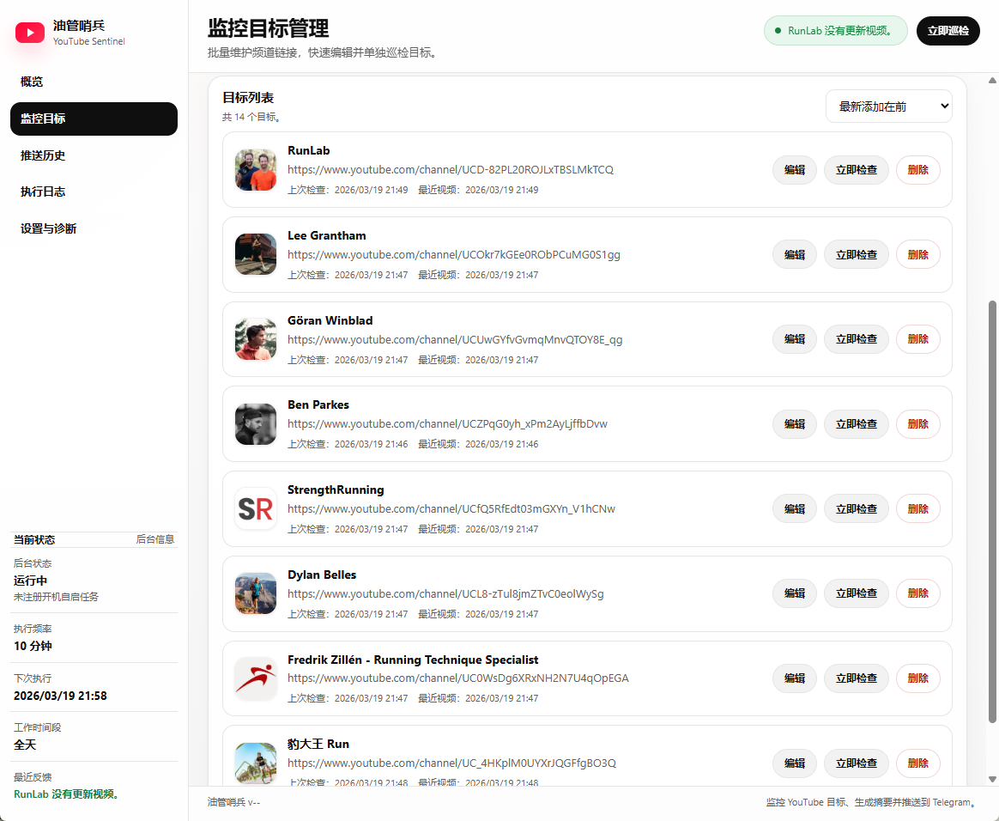

# 油管哨兵 / YouTube Sentinel

一款面向 Windows 的 YouTube 更新监控工具。  
它会在后台定时巡检你指定的 YouTube 目标，发现新视频后尽量提取字幕或元数据，调用 AI 生成中文摘要，并通过 Telegram 推送给你。



## 软件能做什么

- 监控多个 YouTube 目标，支持批量添加
- 后台定时巡检，每个目标每轮只处理最新 1 个新视频
- 优先使用字幕生成摘要，字幕不可用时自动降级
- 支持 Telegram 推送测试、AI 接口测试、网络诊断
- 支持执行日志、推送历史、工作时间段
- 支持开机自动后台运行
- Windows 绿色版，无需安装

## 普通用户请先看这里

### 1. 下载哪个文件

请在 GitHub 的 `Releases` 页面下载 Windows 绿色版压缩包。  
下载文件名类似下面这个的版本即可：

`YouTube Sentinel v1.0.0.zip`

下载后直接解压，不需要安装。

### 2. 正确的首次使用顺序

这个软件依赖后台先正常工作。  
**请先注册开机自启任务，再打开前台界面。**

正确顺序如下：

1. 把压缩包解压到一个固定目录，例如 `D:\YouTube Sentinel`
2. 右键以管理员身份运行 `register-task.bat`
3. 注册完成后，再启动 `YouTube Sentinel.exe`
4. 打开“设置与诊断”，填写：
   - AI Base URL
   - AI API Key
   - AI 模型
   - Telegram Bot Token
   - Telegram Chat ID
5. 点击“保存设置”
6. 先测试 AI 和 Telegram
7. 添加 YouTube 目标
8. 手动执行一次巡检，确认整条链路正常

### 3. 如何取消开机自动后台运行

如果你不再需要开机自启：

1. 右键以管理员身份运行 `unregister-task.bat`

说明：

- 计划任务只负责“开机拉起后台”
- 真正的巡检频率由软件内部调度器控制
- 后台支持无人登录运行

## 重要文件和目录

绿色版根目录大致如下：

```text
YouTube Sentinel/
├─ YouTube Sentinel.exe
├─ register-task.bat
├─ unregister-task.bat
├─ bin/
│  └─ yt-dlp.exe
├─ config/
│  └─ settings.json
├─ data/
│  ├─ sentinel.db
│  └─ avatars/
├─ logs/
└─ ...
```

### 这些目录分别做什么

- `bin/`
  - 放运行依赖的二进制文件
  - 正常发布包里已经包含所需文件
- `config/settings.json`
  - 软件设置文件
  - 保存监控频率、AI、Telegram、界面开关等配置
- `data/sentinel.db`
  - 本地 SQLite 数据库
  - 保存目标列表、视频去重、推送历史、执行日志、诊断结果
- `data/avatars/`
  - 作者头像缓存
- `logs/`
  - 启动日志和运行日志

## 使用说明

### 关于巡检内容

当前内容分析优先级：

1. 优先使用字幕
   - 包括作者字幕
   - 也包括 YouTube 自动字幕
2. 没有字幕时，退化到简介和章节
3. 还不够时，再退化到标题和少量元数据

推送中的来源等级含义：

- `A`：使用了字幕
- `B`：主要使用简介 / 章节
- `C`：主要使用标题 / 少量元数据

### 关于 AI token 消耗

当前策略是字幕优先。  
这会提升摘要质量，但也意味着：

- 有字幕的视频，AI 输入会更长
- token 消耗通常会高于“只看标题和简介”的方案

程序内部已经做了截断控制，但长视频仍然可能比短视频消耗更多 token。

### 关于代理

当前后台网络请求默认走系统代理。  
如果你的网络环境需要代理，请先确认：

- 系统代理本身可用
- Telegram、AI 接口、YouTube 在该代理下都可访问

## 从源码运行

这一部分主要给技术人员和 AI 使用。

### 环境要求

- Windows
- Node.js 22

### 开发版启动方式

开发版前后台是分开的：

1. 先运行 `dev-worker.bat`
2. 再运行 `dev-ui.bat`

说明：

- 前台不会自动拉起后台
- 后台也不会自动拉起前台

### 常用命令

```bash
npm run typecheck
npm run build
build-release.bat
```

### 打包

执行：

```bat
build-release.bat
```

脚本会：

1. 清空 `dist`
2. 构建前后台
3. 用 `electron-builder` 生成目录版
4. 整理出最终绿色目录 `dist\YouTube Sentinel`
5. 最后等待按键退出

## 面向维护者的技术文档

更详细的实现说明请看：

[`docs/TECHNICAL.md`](docs/TECHNICAL.md)
